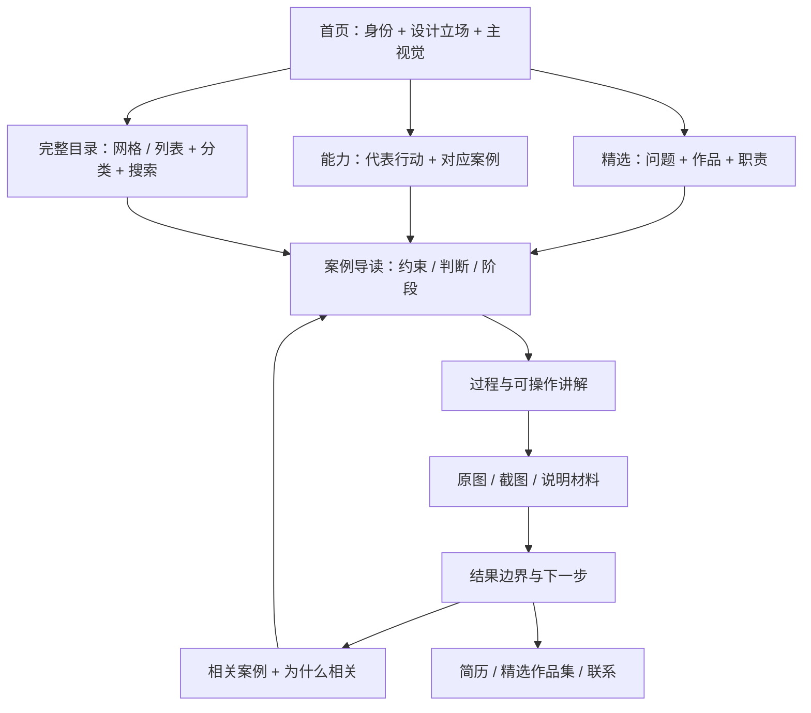

# 作品集逻辑架构 v4

核查日期：2026-09-15。范围：作品集的内容组织、阅读路径、项目身份、能力证据与关联推荐。本文保留改动前的诊断，并记录本轮实际实现；代码核对与浏览器验收分开陈述。

## 判断与边界

**FACT**：现有网站已经具备 33 个案例、中英双语、项目职责/合作署名/阶段、六个策展章节、五种筛选类别、八个交互讲解案例，以及独立下载件。需要优化的是这些对象之间的关系，不是重新发明一套经历。

**INFERENCE**：招聘方希望快速判断职责与交付物，同行更可能继续阅读过程和图像细节。两种访问意图支持“快速了解”和“深入阅读”并行；本轮没有访问者研究，不能把这个推断写成已验证的用户洞察。

**JUDGMENT**：最有价值的改动是让每一个视觉入口都通往一个明确问题、个人行动与可检查的作品材料。动画的职责是表达进入、选择、展开和返回；单独增加效果数量无法补全这些关系。

## 本轮已实现的逻辑

| 对象 | 本轮实现 | 来源与验证入口 |
| --- | --- | --- |
| 首页作品入口 | [Studio.tsx](../web/src/ui/Studio.tsx) 的 4 个设计视角共享单一 selection；图片、序号、标题和案例链接一起变化。3 项精选与六个章节随后展开。 | 主视觉四项、首页精选三项、章节引用和可交互案例是不同阅读用途；它们都解析为现有 WorkDoc slug，没有被合并成一个“精选数”。 |
| 完整目录 | [App.tsx](../web/src/App.tsx) 网格与列表共用同一作品集合、筛选和搜索；标题、类别、摘要来自同一 WorkDoc。 | 保留唯一项目身份及原生案例地址；菜单式悬浮图预览没有照搬。职责、合作署名与阶段可在 CasePage 首屏读取。 |
| 个人档案 | [profile.ts](../web/src/data/profile.ts) 在 [profile.json](../web/src/data/profile.json) 事实主档上补充双语叙述；[StudioProfile.tsx](../web/src/ui/StudioProfile.tsx) 呈现工作、教育、独立实践、原则和下载。 | [个人叙事记录](personal-narrative-v4.md) 保留来源映射。工具从定位主角变成具体能力的辅助材料。 |
| 能力与方法 | 实际采用 **6 项能力**，每项附现有案例链接；**5 步方法**通过按钮同步解释和示例案例。能力使用原生 details/summary 展开。 | 能力有 product-system、spatial-visualization、brand-systems、interaction、ai-workflows、review-delivery 六个稳定 id；是编辑判断，不是新增任职、认证或业务结果。 |
| 案例阅读 | [CasePage.tsx](../web/src/ui/CasePage.tsx) 的摘要、事实区和“如何阅读”导航进入真实正文标题。既有 Markdown 与交互讲解保留；Formline、砚台的双语资料由本轮内容任务补充。 | 未新增建议中的统一 CaseGuide 表。具体导读与交互说明以案例现有材料为准，不能据首屏导航声称新增了项目专属问题数据。 |
| 有理由的关联 | [caseRelations.ts](../web/src/data/caseRelations.ts) 优先人工关联，其次共同能力，再次同章；最多 2 个有效、不重复且非自身的目标，理由随链接显示。 | [verify-case-relations.mjs](../scripts/verify-case-relations.mjs) 覆盖所有作品与两种语言；不再将多数案例统一指向同一对数字工具。 |
| 三维与运动 | 原有人物 GLB 继续使用，App 按视口与 document.hidden 控制 active；全局暂停/低动态关闭装饰运动。首图立即加载，其他目录图按需加载。 | 小人像使用原模型初始姿态与指针视差；旧履历五段镜头不再作为新首页导览。没有引入无限走廊、全站 wheel 拦截或新的三维模型。 |
| 查看与返回 | 当前案例身份由 hash slug 维持；媒体查看器保持局部状态；首页入口保留修饰键点击与 return-focus 标记。 | 实际历史、焦点、筛选和滚动恢复需由浏览器检查；仅存在状态代码不能当作全部实测通过。 |

实际能力数从最初建议的 4–5 项调整为 6 项，以区分交互实现、AI 工作流与版本交付。首页视角与精选顺序采用显式数组，现有 FEATURED/DEEP_CASES/章节引用仍各司其职；没有为形式上的统一而删除不同用途的数据。

已执行关系数据核验：`node scripts/verify-case-relations.mjs` 通过，覆盖 33 个案例与 132 个双语推荐，检查有效目标、确定性顺序、排除自身/重复及无关默认项。这是数据逻辑验证；不替代下方的浏览器操作验收。

素材处理边界：本轮 HUHU 透明背景图的 imagegen 请求返回 HTTP 500 / convert_request_failed，没有新生成图进入作品材料。原图保留；原 portrait.webp 已核验为 RGBA（1280 × 720，alpha 0–255），由 App 直接作为静态后备使用。半透明导航与图注叠层是布局处理，不是摄影真实性或产品验证证据。

## 改动前基线 → 来源 → 原始建议

下表“基线”描述本轮改动前的情况，已修复项不应再被当成当前缺陷。建议与实际实现有差异时，以上一节为准。

| 改动前事实与影响 | 源码来源 | 当时建议的新逻辑 | 建议的验证 |
| --- | --- | --- | --- |
| [workDocs.ts](../web/src/data/workDocs.ts) 有 FEATURED 12 项，[editorial.ts](../web/src/data/editorial.ts) 有 DEEP_CASES 8 项，[chapters.ts](../web/src/data/chapters.ts) 另有 featured 集合。三者目标不同，但“精选”角色容易混淆。 | [Hamish 首页](https://github.com/HamishMW/portfolio/blob/b7444bc16216f38c64f4afb8d2f53b8c4cbb2bda/app/routes/home/home.jsx) 使用少量明确 ProjectSummary；[Jodie modify-grid](https://github.com/LekoArts/gatsby-starter-portfolio-jodie/blob/f023db23e3d4c157741c92d2e54d6027922dc830/src/%40lekoarts/gatsby-theme-jodie/utils/modify-grid.ts) 显式处理展示顺序。 | 区分首页主推、完整目录、深度案例、章节引用。只保留一份首页排序；讲解深度由是否有案例讲解数据决定。 | 首页只读首页主推配置；目录读全量 WorkDoc。校验每个 slug 存在、主推不重复、深度标记与实际组件一致。 |
| 六章与五类不是同一维度；go-glow、baobab-glow 的主归属是产品，却也在渲染章被推荐。交叉引用本身合理，但不能被误读为重复项目。 | [Emilia 内容规范](https://github.com/LekoArts/gatsby-starter-portfolio-emilia/blob/616037c5207da1b111eef0c22ef2d3bea9e9b7dd/README.md) 分离项目 slug 与 areas。 | category 回答“哪类作品”；chapter 回答“策展顺序”；capability 回答“可以看到什么能力”。作品只有一个身份，允许多个能力引用。 | 保留现有类别，不为策展改写历史身份。全目录 33 个唯一 slug；能力和章节只保存引用。 |
| [App.tsx](../web/src/App.tsx) 的关于区列出 Rhino/KeyShot/Blender/Figma/CMF/AIGC，工具名没有直接连接到成果。 | [Polaris schema](https://github.com/educlopez/Polaris/blob/c78407dd8e678d10697366a4f11d95030bf7d69f/src/content.config.ts) 将 challenge/solution/results 固定为内容字段；[Polaris 首页](https://github.com/educlopez/Polaris/blob/c78407dd8e678d10697366a4f11d95030bf7d69f/src/pages/index.astro) 由配置读取身份与经历。 | “我能做什么”连接代表案例、本人行动和交付物，工具作为补充。 | 增加 4–5 个能力条目，每项 1–3 个既有 workSlugs；链接打开真实案例，不能只改变装饰状态。 |
| 案例首屏已有 role/credits/status，但详细问题在正文第三节，交互讲解目前先于背景全文。首次访问者可能先操作却不知道要观察什么。 | [xdesro 案例模板](https://github.com/xdesro/true-terrors/blob/e84aa9c1bd13b7845f8a1b996575be794227994a/src/_includes/layouts/_case.njk) 将 abstract、Discipline、Tenure 放在正文前；[David 内容块](https://github.com/davidhckh/portfolio-2025/blob/f331fe16f507d52b60348fee73d56ab7ec330e56/src/content/projects/en/particles.ts) 给每个媒体块定义说明。 | 首屏先提供一句问题、职责、主要判断与当前阶段；交互前说明“操作什么、观察什么”。正文承接约束、取舍、结果与下一步。 | 优先扩充轻量案例导读；保留原有 Markdown 档案和事实字段。测试首屏不需操作即可理解职责与问题。 |
| relatedCases 对多数非深度案例统一返回 Periastra/Lensflow；推荐摘要不能解释为什么相关。 | [InlineMenuLayout](https://github.com/codrops/InlineMenuLayout/blob/ccfb1d128002efe53c83703aaa5fbb438036259f/src/js/menuController.js) 保存当前对象并准确配对内容；[Jodie 内容样本](https://github.com/LekoArts/gatsby-starter-portfolio-jodie/blob/f023db23e3d4c157741c92d2e54d6027922dc830/content/projects/neon/index.mdx) 分离类别与标题。 | 首选作者编辑的关联理由，其次同能力/同章的稳定候选；不把数字产品当所有项目的默认终点。 | 每个推荐包含目标 slug 与一句 reason；排除自身、去重，保留 2 项。用结构化校验覆盖全部 33 个案例。 |
| [mediaLabel](../web/src/data/editorial.ts) 依据路径和扩展名推断“原始项目图/界面/说明图”。这能区分展示类别，无法证明摄影、加工或测试。 | [David media props](https://github.com/davidhckh/portfolio-2025/blob/f331fe16f507d52b60348fee73d56ab7ec330e56/src/content/projects/en/particles.ts) 保留 alt/caption；[rampatra 模板](https://github.com/rampatra/photography/blob/f2c2d5e18debfbb947ce510d8e7f9ded0520d2f0/index.html) 区分原图与缩略图。 | 将材料种类与证据强度分开：概念图、原始渲染、保存截图、设计说明、真实照片分别说明；“真实照片”只由来源证据支持。 | 新素材必须有来源与简短图注；现有资料不能凭目录名提升为照片或生产验证。大图查看器继承同一图注。 |
| 作品集、简历、首页和案例都提到职责与阶段，若各自手写会出现漂移。 | [ECarry ProfileCard](https://github.com/ECarry/photography-website/blob/1b987df6a66b3731dd15060f6abe28969793f553/src/modules/home/ui/components/profile-card.tsx) 统一读 siteConfig；[Emilia 配置](https://github.com/LekoArts/gatsby-starter-portfolio-emilia/blob/616037c5207da1b111eef0c22ef2d3bea9e9b7dd/gatsby-config.ts) 集中站点身份。 | 身份、经历与联系方式以 profile 为准；项目身份以 WorkDoc 为准；导读与能力表只补关系，不复制另一份身份数据。 | 下载件导出后比较姓名、联系方式、职位、项目职责与阶段；不能仅检查 PDF 文件存在。 |
| 三维、目录预览、大图和案例实验各有自己的当前项与返回操作，容易在视觉状态改变后失去原入口。 | [Hamish ProjectSummary](https://github.com/HamishMW/portfolio/blob/b7444bc16216f38c64f4afb8d2f53b8c4cbb2bda/app/routes/home/project-summary.jsx) 同时考虑可见和聚焦；[TooltipTransition](https://github.com/codrops/TooltipTransition/blob/689dfac88af4c81f4ba11d62cacc25d268c5d789/src/js/index.js) 区分预览、图集、放大；[WebGPU 草案 Gallery](https://github.com/bruno-quintela/portfolio-webgpu/blob/da71cc3ddb54a7a7b0878dc6aa647dd836163feb/components/Gallery/Gallery.tsx) 用回调同步图与文字索引。 | 所有入口遵守“预览不改变身份，进入改变路由，放大是局部查看，关闭回到原控制”。 | 保留浏览器后退/前进、目录筛选、滚动与焦点；低动态和触摸环境仍有同等内容入口。 |

## 阅读路径

首页主视觉和文字应在同一屏表达身份，不把完整教育与工作年表设为浏览作品的必经路。保留时间线作为关于区的可选深入内容；现有三维镜头如依赖时间线锚点，应同步调整锚点与降级逻辑，不能单独移动 DOM 后保留旧动画映射。

目录的封面、图注、分类和案例标题来自同一 WorkDoc。悬停/聚焦只显示预览，不自动换页、不改筛选、不改变历史。移动端直接点击案例，不能要求先 hover 才知道作品是什么。

## 研究阶段的数据建议及实际差异

保留现有 Markdown 和 profile，不要求迁移到 MDX、CMS 或新框架。研究阶段推荐以下两组关系；本轮已用 profile.ts 实现能力，用 caseRelations.ts 实现带理由的关联，其余案例导读仍通过原 Markdown 与 CasePage 呈现：

- **能力**：稳定 id、双语标题、一句行动描述、已有作品 slug 数组。
- **案例导读**：已有 slug、双语问题、主要判断、观察提示、证据入口、能力 id、带理由的关联 slug。

已有 role、credits、status、title、cover 不在导读重复存储。没有充分证据的结果写成具体产物或待验证问题；不补写用户数量、转化提升、客户评价、临床效果或量产完成。

下面是研究阶段的五组建议，属于**策展判断**；最终六项能力及其案例映射以 profile.ts 为准，不是新增工作经历：

| 能力入口 | 代表材料 | 可以检视的行动 |
| --- | --- | --- |
| 空间叙事 | hermes、arcteryx | 商品、道具、背景与观看顺序的三维呈现 |
| 产品与系列 | lighting、plumber、huhu-care | 单体/系列关系、操作角色、结构表达 |
| 材料与视觉 | rendering-studies、lighting | 表面、光线、边缘与比例的表现 |
| 品牌系统 | periastra、biyuan、yelisi | 标志规则、应用尺度、品牌与产品关系 |
| 数字体验 | lensflow、resume-formatter、xintiao | 输入、确认、反馈、局部失败恢复 |

每项文案仍需服从现有项目 role：团队协作项目写“参与”及具体范围，个人数字工具按已有仓库和运行证据描述。不能因为被列为某能力的代表案例，就升级为全部由本人独立设计或完成。

## 案例讲解的统一逻辑

推荐顺序为：**问题 → 约束 → 我的行动 → 取舍 → 作品材料 → 结果边界**。这是一套阅读逻辑，不要求每个案例都使用六个完全相同的大标题。

交互讲解必须能回答一个具体问题。例如：灯具视图切换观察哪些特征跨尺度不变；Hermès 季节切换观察商品与道具层次；Periastra 缩放观察负形与笔画；Lensflow 恢复操作观察成功结果是否保留。控件状态、图片、图注和解释由同一个选中 id 驱动。

“来源说明”就近而简短，优先写访客能理解的材料属性，如“原始概念渲染”“保存的界面截图”“本地交互样例”。详细核查与许可放在文档，不在首屏堆积技术过程。

## 浏览器验收要求

以下是实现验收要求，由集成任务检查；本研究文档不把源码核读升级为浏览器全部通过。研究数据与引用自身的检查结果记录在 [核查快照](open-source-verification-v4.json) 的 artifactValidation 字段。

1. 33 个唯一项目、中英 slug 一致；主推、能力、实验与推荐都解析到存在的项目。
2. 精选有摘要及清晰案例入口；案例首屏可读取问题背景、本人职责与阶段；实验说明操作与观察目的。
3. 每个推荐有理由，排除自身和重复，非深度案例不再全部回落到同一对项目。
4. 筛选和搜索可组合；零结果有清除入口；返回后恢复筛选、位置和原控制焦点。
5. 原生浏览器后退/前进、直接地址刷新、中英切换、修饰键新标签页行为正常。
6. 键盘与触摸能访问同等内容；低动态模式不依赖逐字揭示、横向滚动或三维才能阅读。
7. 图片、图注、阶段与证据入口一致；查看大图关闭后回到原图按钮。
8. 原始资产没有因强调色、渲染或路径标签被误写为摄影、商业结果或生产证明。
9. 简历与作品集下载内容和网页身份/项目事实一致；开源案例只作参考和致谢，不进入个人业绩列表。

## 取舍

更少的主推项可能降低第一次浏览时的项目数量，但完整目录仍保留广度。精选负责证明判断，目录负责查找，履历负责交代背景，三者各有目的。

大幅逐字动画和无限滚动可以制造视觉冲击，但会拉长阅读路径、增加焦点和历史恢复难度。本轮实际采用可逆四视角主视觉、尺度交替、目录视图切换和与解释同步的局部交互。文字内图像展开、悬浮目录 Flip 和完整三维走廊没有采用。

外部源码与许可核查见 [开源研究 v4](open-source-research-v4.md) 和 [核查快照](open-source-verification-v4.json)。来源许可不授予作者项目、品牌、字体或示例图片的新使用权。
