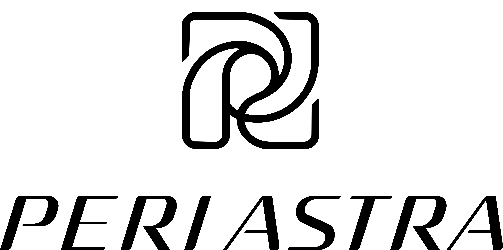

# Periastra Logo 设计分析

## 01. 品牌定位

- **品牌名称**：Periastra
- **品牌品类**：相机包 / 摄影装备收纳 / 影像生活方式配件
- **Logo 类型**：字母变形标志 / 抽象图形标志 / Monogram
- **核心母题**：字母 P、漩涡、相机镜头、保护结构
- **视觉关键词**：旋转、包裹、聚焦、秩序、收纳、影像、流动、安全感

## 02. 图形逻辑

### 字母 `P` 的品牌识别

Periastra 的首字母是 `P`，因此 logo 以 `P` 作为最直接的品牌入口。图形并没有直接呈现普通英文字母，而是将 `P` 的竖向结构、圆弧结构和内部负形重新组织，形成更强的图形记忆点。

### 相机镜头的旋转与聚焦

中央环形结构具有明显的镜头感。内部圆弧与外部回旋线条形成视觉聚焦，类似光圈、对焦环或镜头旋转轨迹。这使图形与相机包品类产生直接关联，而不只是字母设计。

### 旋转秩序带来的稳定与信任感

Logo 中的回旋结构带有流动、聚合、循环和稳定感。对相机包品牌来说，这可以被转化为“保护设备、稳定收纳、专业可靠”的品牌印象。

## 03. 造型语言

### 外框结构

外部采用接近正方形的圆角框架，四角并非完全闭合，而是通过局部断开形成呼吸感。它让图形更像一个具有容器感的品牌符号，而这正好对应相机包的保护属性。

### 字母 `P` 的变形方式

图形中的 `P` 由多个部分共同暗示：主干、腹部、回旋、边界。这样既保留了字母识别，又避免了普通字母标的平庸感。

### 漩涡与镜头结构

中间旋转结构是最有记忆点的部分。它让 logo 从静态字母转为动态符号，可以被理解为镜头对焦、影像汇聚和视觉轨迹。

## 04. 视觉优点

- 品类关联明确
- 图形记忆点强
- 适合五金、织唛、皮标、压印等产品端应用
- 具有收纳和保护的容器感

## 05. 可优化点

- 线条粗细还可以更统一
- 中央旋涡区域需要降低拥挤感
- 外框断口需要更有设计逻辑
- 字母 `P` 的第一识别还可以更明确
- 高级感可以通过减重与扩大负形实现

## 06. 后续应用

- 金属铭牌
- 拉链头浮雕
- 肩带织唛
- 防尘袋丝印
- 内胆隔板压印
- 包装封签

## 关联页面

- [Periastra 相机包品牌设计](<../00_项目总览/Periastra 相机包品牌设计.md>)
- [镜头旋涡与聚焦隐喻](<../../../notes/03_Logo 设计 Logo Design/器材化隐喻与保护结构.md>)
- [保护结构与容器感](<../../../notes/03_Logo 设计 Logo Design/器材化隐喻与保护结构.md>)
- [Periastra Logo 优化检查点](<../02_应用与优化/Periastra 应用与优化.md>)
