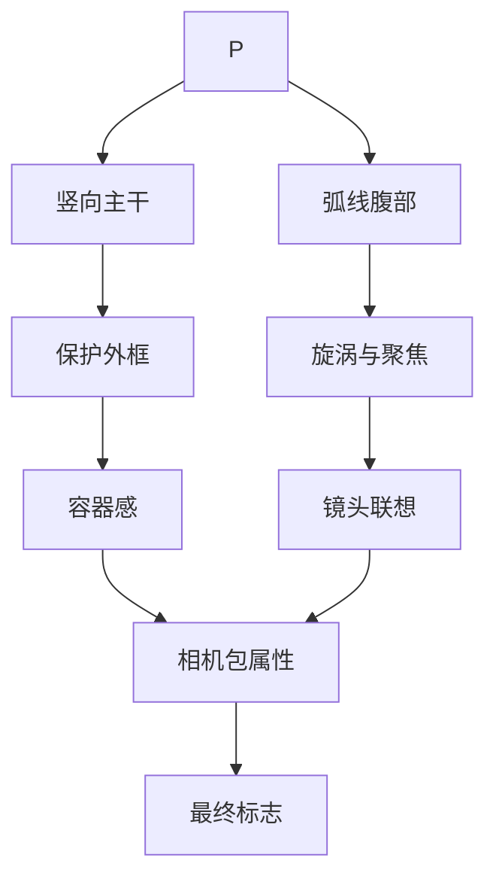

---
project: Periastra
type: structure-flow
status: active
date: 2026-05-15
tags:
  - periastra
  - logo
  - structure-flow
---

# Periastra 结构流程

## 结论

Periastra 不是把 P 做复杂，而是把字母识别、镜头联想和保护结构压进同一个器材符号里。

## 入口

- [Periastra 相机包品牌设计](<00_项目总览/Periastra 相机包品牌设计.md>)
- [Periastra Logo 设计分析](<01_Logo 设计/Periastra Logo 设计分析.md>)
- [Periastra 应用与优化](<02_应用与优化/Periastra 应用与优化.md>)
