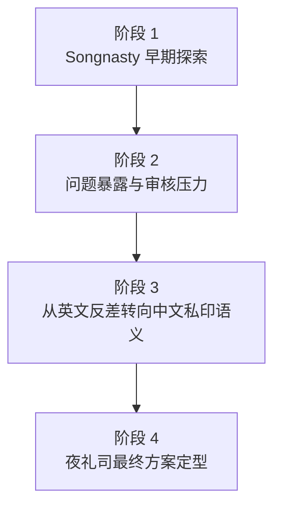

# 夜礼司 Logo 演化时间线（原 Songnasty 方案）

## 当前目的

这页不是重复展示最终方案，而是明确记录：`Songnasty` 如何经过命名、语义、图形结构和品牌气质的连续优化，最终转向 `夜礼司`。

结论先写清楚：

- `Songnasty` 不是错误方向，而是早期有效探索
- `夜礼司` 不是简单改名，而是品牌结构逻辑升级
- 旧方案应保留，但只能作为历史阶段，不再主导现行系统

## 演化流程

## 阶段 1：Songnasty 早期探索

这一阶段的核心任务，是验证品牌能否通过：

- 英文名称
- S 曲线
- 女性身体隐喻
- 宋式私印感

建立差异化识别。

这个阶段的价值不在于最后是否沿用，而在于它确认了两件事：

1. 品牌确实需要“身体感”，但不能直白
2. 图形确实需要“印面秩序”，否则会流于普通女性向时尚 monogram

### 阶段代表图

### 阶段判断

- 优点：反差明确，图形已有记忆点
- 局限：英文名外放，品牌语义偏挑衅，审核风险高
- 核心问题：图形仍然容易被读成 `S monogram`，中文语义没有成为第一识别层

## 阶段 2：问题暴露与方向压力

随着品牌继续向产品化和可商用推进，旧方案暴露出几个结构性问题：

### 1. 审核问题

`Songnasty` 作为英文工作名，在语义上过于靠近挑逗和外放表达。对于当前的品牌环境和平台限制，这不是稳定资产。

### 2. 品牌中心不够稳

旧方案的第一识别层更接近：

- 英文名
- S 曲线
- 反差性感

而不是：

- 中文品牌语义
- 印面秩序
- 仪式感与权柄感

### 3. 中文品牌气质尚未建立

旧方案虽然已经借用了宋式私印和女性曲线，但中文名称并没有真正成为结构中心。品牌更像一个“英文名驱动的东方化 monogram”，而不是一枚真正站得住的中文私密品牌印记。

## 阶段 3：从英文反差转向中文私印语义

这一阶段不是换皮，而是重新确定品牌命题。

新的核心命题被压缩为：

> 以夜为境，以礼为序，以司为权。

这一步带来的变化是根本性的：

| 维度 | Songnasty 阶段 | 夜礼司 阶段 |
|---|---|---|
| 命名中心 | 英文工作名 | 中文正式品牌名 |
| 图形主轴 | S 曲线与女性身体 | 私印印面与篆书秩序 |
| 身体感位置 | 第一识别层 | 第二识别层 |
| 品牌情绪 | 反差、挑衅、时装化 | 威严、私密、仪式化 |
| 文化来源 | 宋式印感 + 英文 monogram | 宋式私印 + 篆书语义 + 夜间礼制想象 |

也正是在这个阶段，中心曲线的角色发生了变化：

- 旧逻辑里，曲线更接近主角
- 新逻辑里，曲线仍然保留，但被压低为隐性气韵

这一步是品牌成熟的关键。

## 阶段 4：夜礼司最终方案定型

最终方案不再围绕 `S` 展开，而是围绕：

- 宋式私印
- 篆书空间
- 负形身体曲线
- 中文名称的制度感

来建立识别。

### 当前最终方案

### 当前结论

- 第一眼看到的是秩序、边界、权柄
- 第二眼才感受到女性身体曲线与亲密气息
- 这比旧方案更稳定、更可商用，也更适合长期品牌系统发展

## 为什么旧方案必须保留

旧方案不是噪音，而是演化证据。

保留它的原因有三个：

1. 它证明品牌不是凭空跳到夜礼司，而是经过了真实探索
2. 它能帮助后续判断哪些视觉因素应该继承，哪些应该被降级
3. 它能让整个项目在知识库中形成清晰的优化流程，而不是只剩一个“最终结果”

正确关系应该是：

- `Songnasty`：历史工作名与前期研究阶段
- `夜礼司`：当前正式品牌与现行资产中心

## 最终判断

夜礼司不是对 Songnasty 的否定，而是对其有效部分的收束。

被保留下来的，是：

- 私印感
- 身体负形
- 反差策略

被调整或降级的，是：

- 英文中心
- S monogram 读取
- 更外放的性感语气

所以这条演化线的本质不是“推翻重来”，而是：

> 从一个有效但不够稳定的英文反差方案，优化为一个中文语义明确、印面结构成熟、可长期使用的私密品牌印记。

## 相关链接

- [夜礼司 品牌设计](<../../00_品牌总览/夜礼司 品牌设计.md>)
- [夜礼司 Logo 设计](<../00_项目总览/夜礼司 Logo 设计.md>)
- [夜礼司 Logo 方案与决策](<../01_方案与决策/夜礼司 Logo 方案与决策.md>)
- [夜礼司 Logo 规范与字标](<../02_规范与字标/夜礼司 Logo 规范与字标.md>)
