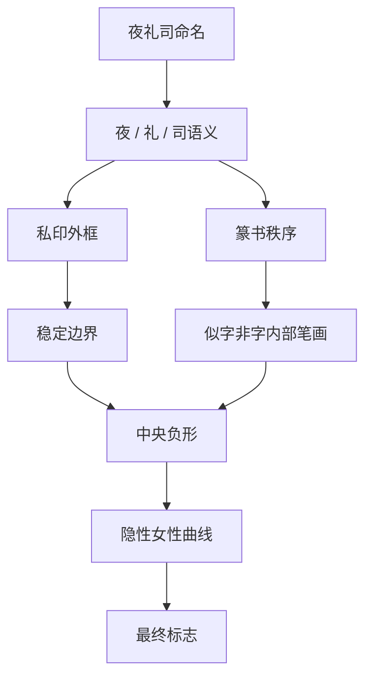

---
project: 夜礼司
type: structure-flow
status: active
date: 2026-05-15
tags:
  - 夜礼司
  - logo
  - structure-flow
---

# 夜礼司 Logo 结构流程

## 结论

夜礼司 Logo 的成立条件只有一句话：先用私印和篆书秩序建立权柄感，再把女性身体曲线压到负形层，不让身体感抢占第一识别层。

## 入口

- [夜礼司 品牌设计](<../00_品牌总览/夜礼司 品牌设计.md>)
- [夜礼司 Logo 方案与决策](<01_方案与决策/夜礼司 Logo 方案与决策.md>)
- [夜礼司 Logo 规范与字标](<02_规范与字标/夜礼司 Logo 规范与字标.md>)
