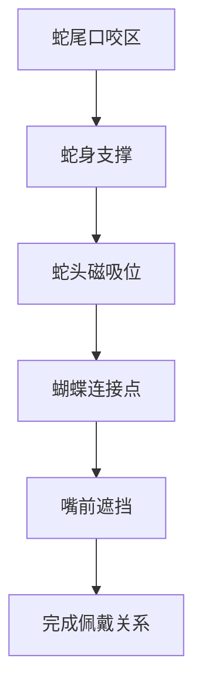
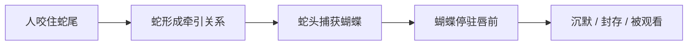

---
project: 夜礼司
type: structure-flow
status: active
date: 2026-05-15
tags:
  - 夜礼司
  - product
  - structure-flow
---

# 蛇形口咬道具 结构与叙事流程

## 结论

这件产品不是蛇和蝴蝶的拼贴，而是把口咬、磁吸、遮挡和意象叙事压成一个结构系统。

## 入口

- [蛇形口咬道具_绒花蝴蝶磁吸配件](<蛇形口咬道具_绒花蝴蝶磁吸配件.md>)
- [身体装置产品的意象、材料与连接结构](<../../../../notes/08_产品与身体装置 Product and Body Object/身体装置产品的意象、材料与连接结构.md>)
