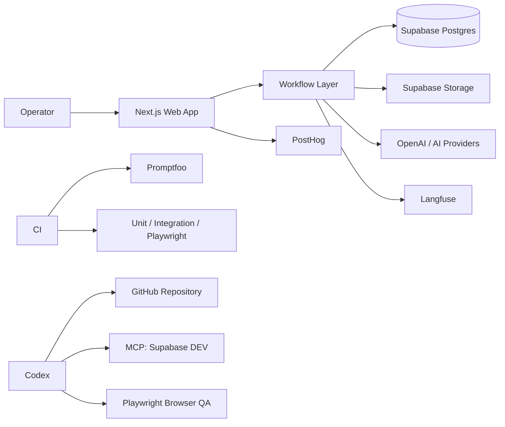
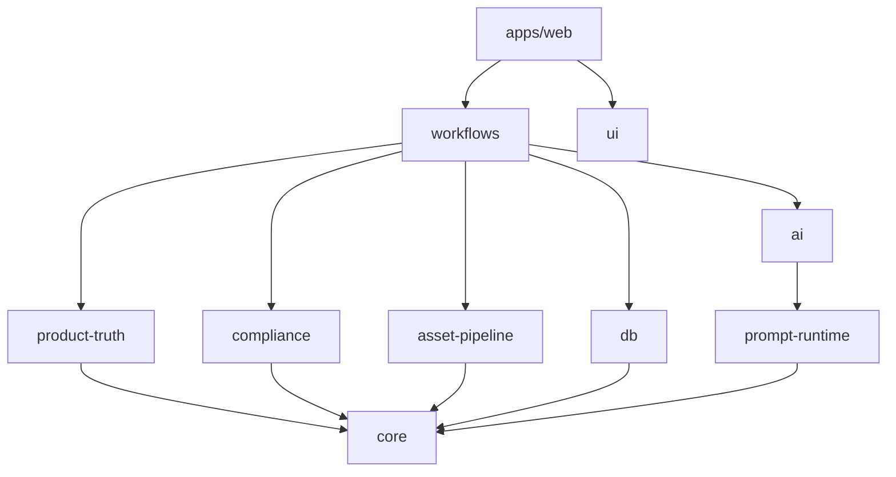
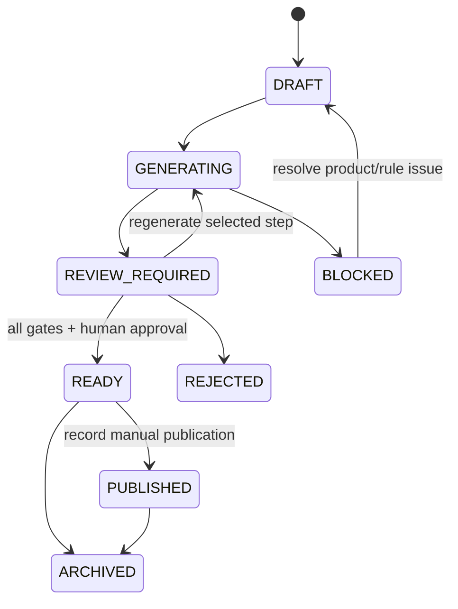

# XHS Operations OS V2 — Architecture

**Architecture style:** modular monolith + explicit workflow orchestration  
**Frontend/runtime:** Next.js + TypeScript  
**Primary datastore:** PostgreSQL via Supabase  
**Storage/Auth:** Supabase  
**AI:** OpenAI Responses API + configured image-generation/editing provider  
**PromptOps:** Langfuse at the PromptOps phase  
**Offline eval/security eval:** Promptfoo + repository eval harness  
**Product analytics:** PostHog at the analytics phase  
**Deployment:** Vercel

## 1. Decision summary

V2 intentionally avoids a multi-service architecture. The operating model is a small-team internal tool, so the preferred design is a modular monolith with strict domain boundaries and asynchronous jobs only where generation or external provider latency requires them.

Reasons:

- simpler deployment and local development;
- easier Codex context management;
- fewer distributed failure modes;
- stronger transactional consistency around review and approval;
- lower integration overhead while product workflows are still evolving.

## 2. System context



## 3. Module map

```text
apps/web
  UI, route boundaries, server actions/API endpoints

packages/core
  domain enums, IDs, validation contracts, invariant helpers

packages/db
  database types, repositories, transactions, query helpers

packages/workflows
  deterministic orchestration and state transitions

packages/product-truth
  truth snapshots, claim decisions, originality constraints

packages/compliance
  rule matching, findings, severity, gate decisions

packages/ai
  model-provider abstractions, structured output execution, retries

packages/prompt-runtime
  prompt composition, remote registry retrieval, fallback, hashing

packages/asset-pipeline
  source asset registration, derivatives, provenance, review states

packages/analytics
  derived metrics, postmortem input builders, experiment analysis

packages/integrations
  Langfuse, PostHog, external publisher interfaces, future connectors

packages/ui
  shared presentational components
```

No package may import directly from `apps/web`.

## 4. Dependency direction



Domain packages expose interfaces; UI code must not encode truth/compliance rules.

## 5. Workflow architecture

The system uses persisted workflow state rather than autonomous agent memory.

### 5.1 Content workflow



### 5.2 Gate order

For generated copy:

1. schema validation;
2. product-truth check;
3. platform compliance;
4. quality scoring/ranking;
5. human review.

For generated images:

1. generation result integrity;
2. asset provenance registration;
3. product-consistency review;
4. platform compliance;
5. visual-quality review;
6. human approval.

A later score cannot cancel an earlier hard failure.

## 6. AI execution model

### 6.1 Structured execution

Every machine-consumed AI step defines:

- `input_schema`;
- `output_schema`;
- `prompt_name`;
- `skill_name`;
- `model_policy`;
- timeout/retry policy;
- evaluation contract.

Use JSON Schema structured outputs when supported. Free-form text is allowed only as a field inside a validated object.

### 6.2 Candidate / judge separation

Tasks where selection materially affects quality use separate runs:

```text
candidate generator
→ deterministic pre-filter
→ independent judge/ranker
→ human choice
```

The judge receives facts/rubric but not hidden chain-of-thought from the generator.

### 6.3 AI run record

Each invocation records:

- workflow run ID;
- step name;
- product/truth snapshot IDs;
- prompt/Skill versions;
- model configuration;
- normalized input hash;
- response status;
- parsed output;
- error category;
- latency;
- token/cost metadata when available;
- Langfuse trace/observation identifiers when enabled.

## 7. Product truth architecture

`product_facts` is not passed raw to the model as one unbounded blob. The workflow builds a compact immutable truth snapshot:

```json
{
  "productId": "...",
  "productVersionId": "...",
  "status": "DESIGNER_CURATED",
  "facts": [],
  "allowedClaims": [],
  "forbiddenClaims": [],
  "unknowns": []
}
```

The exact snapshot ID is attached to all generations so a later product edit cannot rewrite historical truth.

## 8. Compliance architecture

Platform policy is represented as data:

```text
platform_rules
rule_versions
compliance_reports
compliance_findings
```

A rule version contains:

- platform;
- surface (`ORGANIC`, `PAID_AD`, `STORE`, `COLLABORATION`, `GENERAL`);
- category/tags;
- severity;
- normalized rule statement;
- source URL/reference;
- publication/effective/verified dates;
- status (`ACTIVE`, `SUPERSEDED`, `RETIRED`);
- evaluator metadata.

The compliance engine returns findings with rule IDs. LLM assistance may help classify ambiguous content, but rule identity, severity thresholds, and hard blocks remain deterministic.

## 9. Asset architecture

### 9.1 Object storage

Binary assets live in Supabase Storage; the database stores metadata and relationships.

Recommended logical buckets:

- `product-originals` — private;
- `generated-assets` — private;
- `publish-exports` — private/short-lived signed access;
- `brand-assets` — private.

### 9.2 Immutability

Original uploads are immutable. Edits create new asset rows and new objects.

### 9.3 Provenance graph

```text
source product image(s)
      ↓
image job
      ↓
generated asset
      ↓
asset review
      ↓
approved publish asset
```

A publish package references asset versions, not mutable filenames.

## 10. Publisher adapter boundary

```typescript
export interface PublisherAdapter {
  prepare(packageId: string): Promise<PublisherPreview>;
  validate(packageId: string): Promise<PublisherValidationResult>;
  publish(packageId: string, approvalToken: string): Promise<PublisherResult>;
}
```

V2 production implementation:

`ManualPublisher` — generates a validated package and export instructions; `publish` records a manual-publish handoff rather than mutating Xiaohongshu.

Reserved future adapters:

- `OfficialXhsPublisher` if supported by a verified official API;
- `ExperimentalBrowserPublisher` only in an isolated, non-core experimental environment and never as a required V2 dependency.

## 11. Integration boundaries

### OpenAI

Server-side only. Requests include structured context assembled by the workflow. API keys never reach the browser.

### Supabase

- Auth for user identity;
- Postgres for structured state;
- Storage for assets;
- RLS for authorization;
- MCP restricted to development and read-only production diagnostics by default.

### Langfuse

Prompt registry + tracing + eval datasets/experiments. Application must retain local tested fallback prompts so a PromptOps outage does not force unsafe free-form behavior.

### Promptfoo

Runs in development/CI against test targets. It is not in the user request path.

### PostHog

Captures product-operation events, not sensitive prompt contents by default. Events use IDs and safe properties.

### Vercel

Web deployment and environment isolation. Preview deployments never share production secrets unless explicitly required and reviewed.

## 12. Error taxonomy

Use normalized errors:

- `VALIDATION_ERROR`
- `AUTHORIZATION_ERROR`
- `NOT_FOUND`
- `CONFLICT`
- `PROVIDER_RATE_LIMIT`
- `PROVIDER_TIMEOUT`
- `PROVIDER_INVALID_OUTPUT`
- `TRUTH_GATE_FAILURE`
- `COMPLIANCE_GATE_FAILURE`
- `ASSET_CONSISTENCY_FAILURE`
- `EXTERNAL_INTEGRATION_ERROR`
- `INTERNAL_ERROR`

User-facing messages should state the actionable failure without revealing secrets or provider internals.

## 13. Retry policy

Retry only transient provider/network failures. Do not retry deterministic validation, fact, or compliance failures automatically.

Generation retries must:

- be bounded;
- create a new `ai_run_step` attempt;
- preserve the failed attempt for debugging;
- avoid duplicate billing caused by accidental client retries through idempotency keys.

## 14. Observability

Minimum system observability:

- structured server logs with request/workflow IDs;
- AI run metrics;
- generation error categories;
- compliance/fact gate counts;
- asset review outcomes;
- E2E test traces;
- PostHog workflow events when enabled;
- Langfuse AI traces when enabled.

Never put full secret-bearing headers, supplier credentials, platform cookies, or raw private asset URLs into logs.

## 15. Environment model

Environments:

- `local` — developer sandbox;
- `preview` — per-branch Vercel/Supabase branch or isolated dev resources;
- `production` — operator data.

Production migrations are reviewed artifacts. AI coding agents do not receive unrestricted production mutation access.

## 16. Testing architecture

### Unit

Pure domain functions, claim logic, rule matching, schemas, metric calculations.

### Integration

Repositories + test database, workflow orchestration, AI provider stubs, Storage metadata.

### E2E

Playwright verifies full operator flows.

### AI eval

Prompt/model/workflow quality and regression datasets.

### Red team

Prompt injection, tool/permission misuse, sensitive-data leakage, schema/output abuse, and excessive-agency scenarios.

## 17. Architecture decision record summary

### ADR-001 Modular monolith
Accepted. Revisit only when scaling evidence shows an actual deployment/runtime boundary.

### ADR-002 Manual publishing first
Accepted. Protects V2 from brittle unofficial account automation and preserves human approval.

### ADR-003 Product truth as immutable snapshots
Accepted. Required for factual auditability.

### ADR-004 Platform rules as versioned data
Accepted. Required because Xiaohongshu rules can change independently of deployments.

### ADR-005 Structured AI outputs
Accepted. Required for machine consumption and reliable evals.

### ADR-006 PromptOps decoupled from code with fallback
Accepted for the PromptOps phase.

## 18. Key official reference basis

- OpenAI Responses API supports JSON-schema structured outputs for supported models.
- Supabase RLS provides database-enforced granular authorization and should be enabled on exposed tables.
- Supabase MCP documentation explicitly recommends project scoping and provides read-only configuration.
- Langfuse supports prompt versioning, labels, traces, datasets, experiments, online/offline evaluation.
- Promptfoo supports CI evals, quality gates, and red-team testing.
